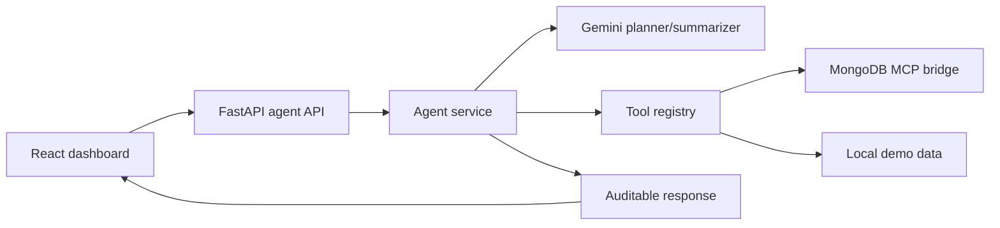

# CivicOps Agent

An agentic operations assistant for public events, built for the Google Cloud Rapid Agent Hackathon.

**CivicOps Agent** helps event operations teams detect crowd pressure, match response resources, draft public guidance, and keep every action reviewable by a human operator. It is designed for the **MongoDB partner track**, where incident records, action history, tool traces, and event context can be stored and queried as live operational data.

## Why it matters

Large public events can become stressful quickly: crowding, transit delays, accessibility issues, vendor shortages, and unclear communication all compound. CivicOps Agent turns scattered operational signals into a clear plan, executes tool-backed steps, and gives staff recommendations they can approve before anything public happens.

## Stack

- Frontend: React, TypeScript, Vite
- Backend: FastAPI, Pydantic
- Agent pattern: plan -> execute tools -> summarize
- Optional AI: Gemini via `GOOGLE_API_KEY`
- Partner track: MongoDB through an MCP bridge via `MCP_SERVER_URL`
- Optional persistence: MongoDB via `MONGODB_URI`

## What it does

- Accepts an operator mission goal, city, partner track, and risk tolerance.
- Uses Gemini when configured to create an agent plan and summarize results.
- Executes traceable tools for incident inspection, partner context lookup, resource matching, and public update drafting.
- Shows integration status so judges can see whether Gemini and MCP are connected.
- Keeps a human-in-the-loop action list for approval.

## Architecture



## Run locally

Backend:

```bash
cd backend
python -m venv .venv
.venv\Scripts\activate
pip install -r requirements.txt
uvicorn app.main:app --reload --port 8000
```

Frontend:

```bash
cd frontend
npm install
npm run dev
```

Open `http://localhost:5173`.

## Demo MCP bridge

To prove the MCP pathway locally before connecting a real partner server, run:

```bash
cd backend
uvicorn app.mock_mcp_bridge:app --reload --port 9000
```

Then copy `backend/.env.example` to `backend/.env`. The main backend will call the mock bridge and the UI will show `MCP: connected`.

For the real MongoDB track, replace the mock bridge with the MongoDB MCP server or an HTTP bridge that forwards JSON-RPC `tools/call` requests to MongoDB-backed tools.

## Connect Gemini and MCP

Create `backend/.env`:

```env
GOOGLE_API_KEY=your_google_ai_studio_or_cloud_key
GEMINI_MODEL=gemini-1.5-flash
MCP_SERVER_URL=http://127.0.0.1:9000/mcp
MCP_AUTH_TOKEN=
MONGODB_URI=your_mongodb_connection_string
MONGODB_DATABASE=civicops_agent
CORS_ORIGINS=http://localhost:5173,http://127.0.0.1:5173
```

When `GOOGLE_API_KEY` is present, the backend asks Gemini to generate the mission plan and summarize the result. When `MCP_SERVER_URL` is present, the backend calls a partner MCP bridge with JSON-RPC `tools/call`.

If either value is missing, the app stays runnable in demo mode and labels the integration status honestly in the API response.

When `MONGODB_URI` is present, completed agent runs are stored in the `agent_runs` collection.

## Smoke test

```bash
cd backend
python smoke_test.py
```

This runs the agent service without the browser and prints the full response.

## Where to customize

- Gemini / Agent Builder orchestration: `backend/app/services/agent_service.py`
- Gemini client: `backend/app/services/gemini_client.py`
- Partner MCP client: `backend/app/services/mcp_client.py`
- Partner MCP tools: `backend/app/services/tool_registry.py`
- Persistent data: replace the in-memory mock data in `backend/app/services/mock_data.py`

## Demo flow

1. Start the backend, frontend, and optional mock MCP bridge.
2. Open the dashboard and choose `MongoDB`.
3. Run the agent with the default public-event mission.
4. Show the plan, tool trace, recommendations, and next actions.
5. Explain that the mock MCP bridge is a local stand-in, and the same adapter can point to the real MongoDB MCP server for final submission.

## Submission assets

- Devpost copy: `DEVPOST_SUBMISSION.md`
- Demo script: `DEMO_VIDEO_SCRIPT.md`
- Deployment guide: `DEPLOYMENT_GUIDE.md`
- MongoDB integration plan: `MONGODB_TRACK_PLAN.md`
- GitHub upload guide: `GITHUB_UPLOAD_GUIDE.md`
- Architecture notes: `PROJECT_ARCHITECTURE.md`
- Final checklist: `SUBMISSION_CHECKLIST.md`
